# ESP-Mesh-Nav

**Indoor Localization with a Distributed ESP32 RSSI Mesh, Extended with IMU–EKF Sensor Fusion**

[]()
[]()
[]()
[]()
[]()

> An undergraduate capstone project that localizes a mobile robot indoors using a network of ESP32 access points and RSSI trilateration, now being extended with an Extended Kalman Filter that fuses RSSI ranging with onboard IMU data for significantly more accurate, drift-resistant positioning.

---

## Table of contents

- [Overview](#overview)
- [System architecture](#system-architecture)
- [Hardware](#hardware)
- [Phase 1 — RSSI trilateration](#phase-1--rssi-trilateration)
- [Phase 2 — EKF sensor fusion (in progress)](#phase-2--ekf-sensor-fusion-in-progress)
- [Repository structure](#repository-structure)
- [Getting started](#getting-started)
- [Roadmap](#roadmap)
- [Author](#author)

---

## Overview

Most indoor positioning demos either rely on expensive UWB anchors or a single Wi-Fi router with very coarse accuracy. This project asks a simpler question: **can a handful of cheap ESP32 boards, mounted on the walls of a room, localize a moving robot accurately enough to be useful — and can adding a low-cost IMU and a proper estimator close the gap to something usable for real indoor navigation?**

The project has two phases:

| Phase | What it does | Status |
|---|---|---|
| **1 — RSSI Mesh & Trilateration** | Multiple ESP32 "access point" nodes are placed at fixed, known positions around a room. A robot-mounted ESP32 scans Wi-Fi signal strength (RSSI) from each access point, relays the readings over ESP-NOW to a master node, which streams them to a laptop. A Python script converts RSSI to estimated distances and trilaterates the robot's 2D position in real time. | Complete — preliminary results below |
| **2 — IMU + EKF Sensor Fusion** | The robot is fitted with an IMU. An Extended Kalman Filter fuses noisy RSSI-based range estimates with IMU-derived motion (velocity, heading, angular rate) to produce a smoother, more accurate, and more robust position and heading estimate than RSSI trilateration alone. | In progress — full mathematical derivation complete, Python simulation running, hardware integration next |

This repository documents both phases: the original hardware build, firmware, and trilateration results, and the ongoing EKF extension with its full derivation and simulation.

---

## System architecture

<p align="center">
  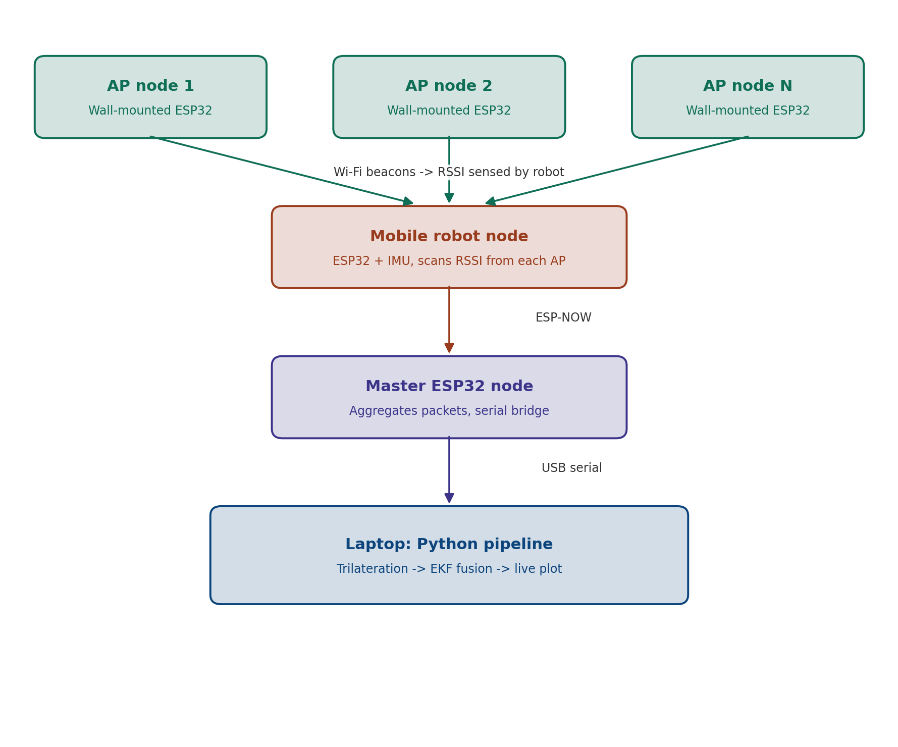
</p>

The system has four logical layers:

1. **Access point nodes** — Several ESP32 boards are mounted at fixed, surveyed positions on the walls of the test room. Each one runs a minimal firmware that simply advertises a Wi-Fi access point (SSID + fixed channel), giving the robot a stable RSSI source to measure against.
2. **Robot node** — An ESP32 mounted on the mobile robot continuously scans for each access point's SSID, reads the corresponding RSSI value, and packages all readings (and, in Phase 2, IMU data) into a single payload.
3. **Master node** — A separate ESP32 acts as the central receiver. It listens for ESP-NOW packets from the robot node and relays them over USB serial to a laptop. ESP-NOW was chosen over standard Wi-Fi/HTTP for this hop because it is connectionless, low-latency, and doesn't require the robot to join a network — it only needs to scan for beacons.
4. **Host-side Python pipeline** — On the laptop, incoming serial data is parsed, converted from RSSI to estimated range using a log-distance path-loss model, and fed into either:
   - a **trilateration solver** (Phase 1), or
   - the **Extended Kalman Filter** (Phase 2), which additionally consumes IMU data,

   with the result rendered live in a 2D matplotlib visualization showing the robot's estimated position relative to the known access point locations.

---

## Hardware

The robot chassis is a two-tier acrylic platform on a 4-wheel differential/skid-style drive base, carrying the motor driver, ESP32, and supporting perfboard circuitry between the lower two decks.

<p align="center">
  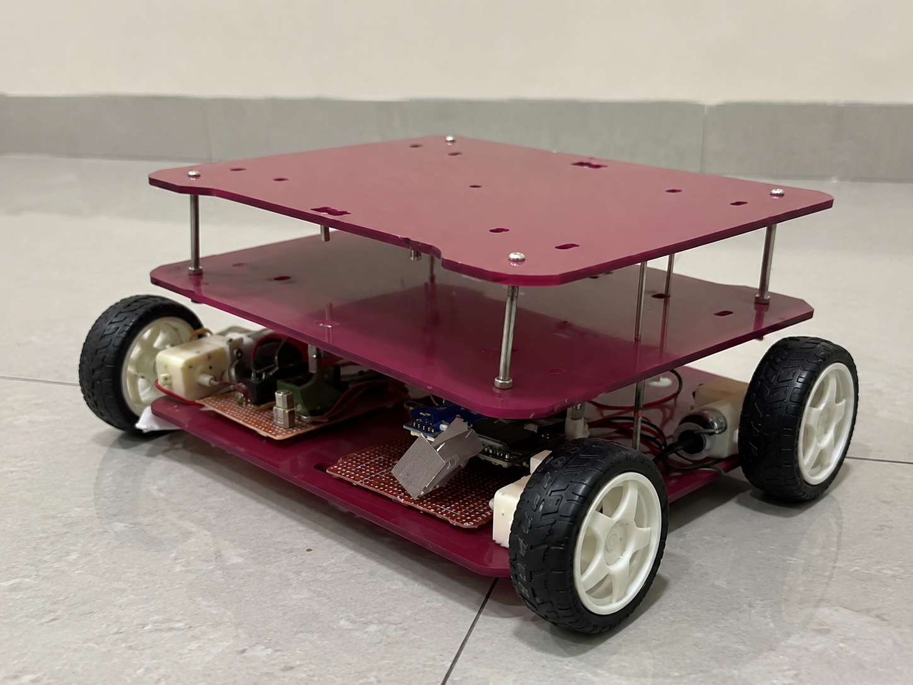
</p>

| Component | Role |
|---|---|
| ESP32 dev board (×1, robot) | Scans AP RSSI, reads IMU (Phase 2), transmits via ESP-NOW |
| ESP32 dev board (×1, master) | Receives ESP-NOW packets, bridges to laptop over serial |
| ESP32 dev board (×N, access points) | Each broadcasts a fixed-position Wi-Fi beacon |
| DC gear motors + driver | Robot drive |
| IMU (Phase 2) | Provides acceleration, angular rate, and heading for EKF prediction step |
| Two-tier acrylic chassis (custom-cut) | Houses electronics; designed in Fusion 360 |

A render of the CAD design alongside the physical build:

<p align="center">
  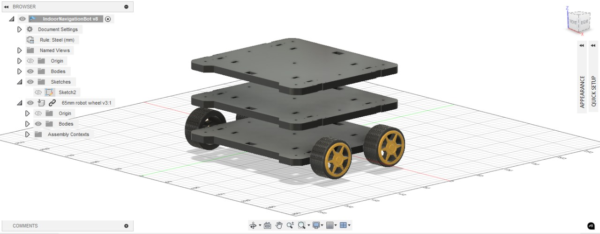
  &nbsp;&nbsp;&nbsp;
  
</p>

I will upload full CAD source and exported views in future:  [`hardware/fusion360/`](hardware/fusion360).

---

## Phase 1 — RSSI trilateration

### How it works

1. Each access point ESP32 is placed at a fixed, manually measured `(x, y)` coordinate and configured with a unique SSID.
2. The robot's ESP32 performs a Wi-Fi scan, reads the RSSI for each known AP SSID, and packages `{ap_id, rssi}` pairs.
3. Readings are sent via **ESP-NOW** to the master node, which forwards them over serial to the host laptop.
4. The Python visualization script:
   - converts each RSSI reading to an estimated distance using a log-distance path-loss model,
   - solves for the robot's 2D position via multi-point trilateration (least-squares over all available AP ranges),
   - plots the access points and the estimated robot position live.

### Preliminary results

Two experiments were run to validate the pipeline before adding the EKF:

**Experiment A — static robot.** The robot was held stationary and the visualization was captured at three separate instants, to check the stability/noise of the position estimate when there should be no motion at all.

<p align="center">
  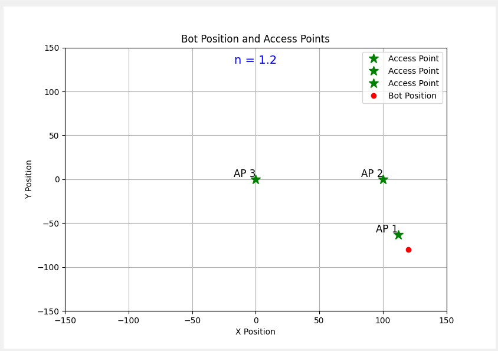
  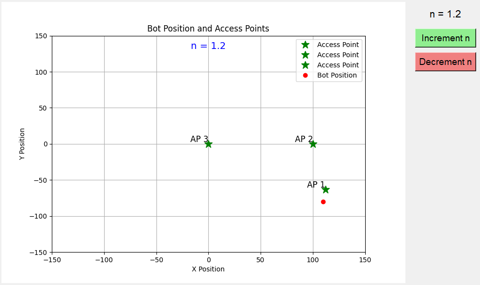
  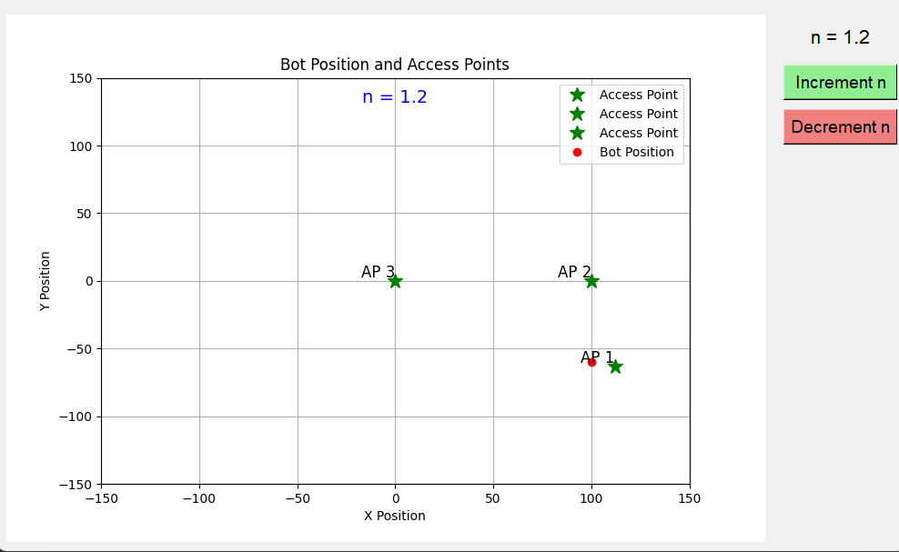
</p>

**Experiment B — robot in motion.** The robot was moved from the vicinity of access point 1 to access point 2, with the visualization captured at eight points along the path to confirm the estimated position track follows the true direction of travel.

<p align="center">
  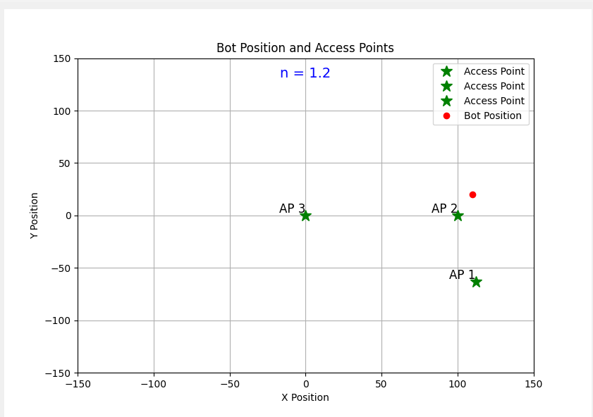
  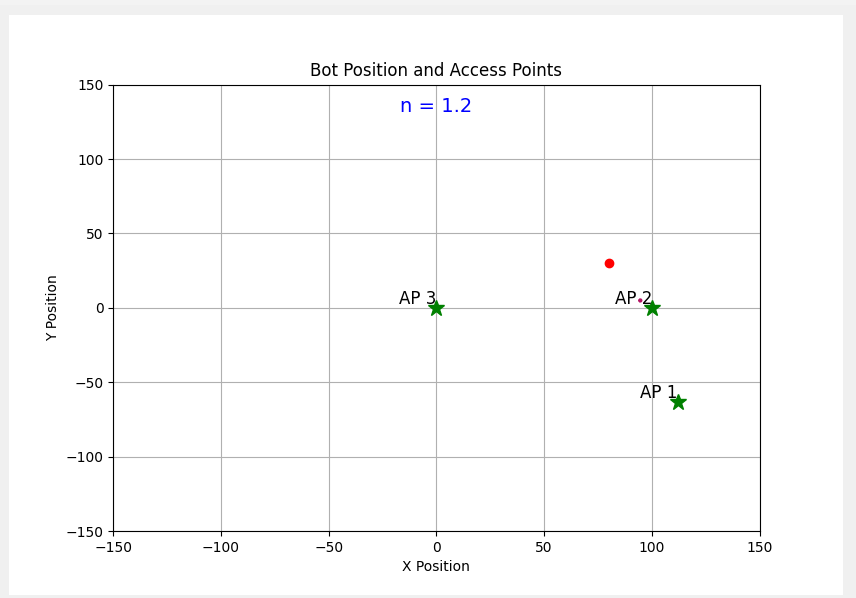
  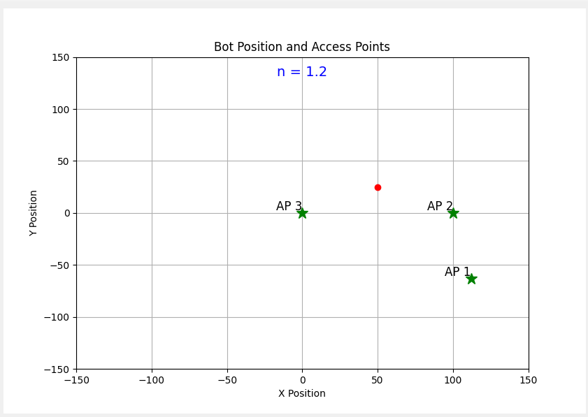
  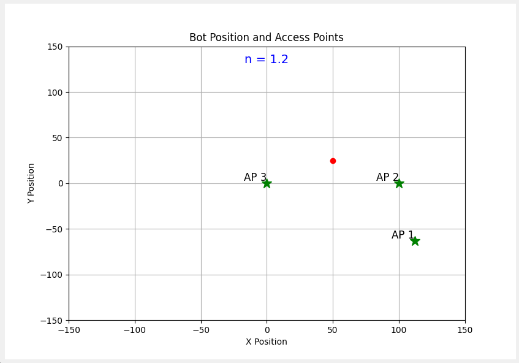
</p>
<p align="center">
  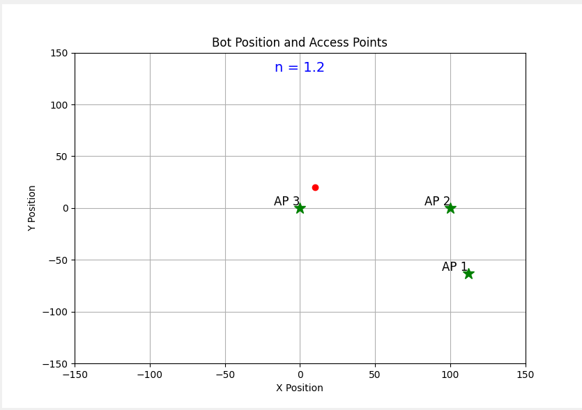
  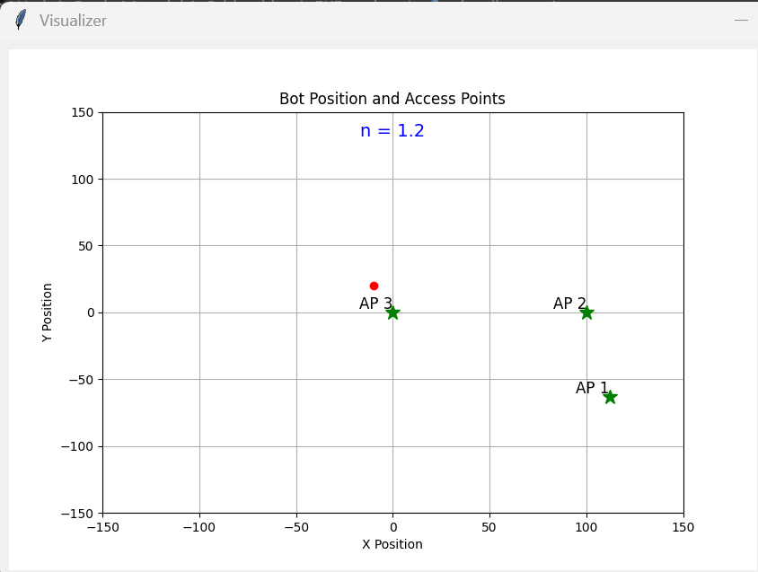
  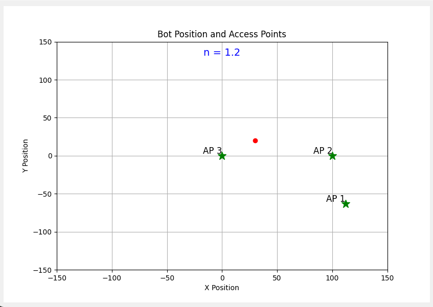
  
</p>

**Takeaway:** raw RSSI trilateration is functional and clearly tracks gross movement between access points with an accuracy of *3m-5m*, but — as expected from any RSSI-only system — the static captures show visible jitter in the estimated position even when the robot doesn't move. This noise sensitivity is the core motivation for Phase 2.

Code: Once I finalize the code, everything will be uploaded too: [`software/phase1_visualization/`](software/phase1_visualization) · Firmware: [`firmware/`](firmware)

---

## Phase 2 — EKF sensor fusion (in progress)

### Motivation

RSSI-to-distance conversion is noisy — multipath, body shadowing, and the coarse granularity of RSSI all degrade trilateration accuracy, as seen in the Phase 1 static-test jitter above. An IMU, on the other hand, drifts over time but is locally very precise over short intervals. An **Extended Kalman Filter (EKF)** is a natural way to fuse the two: use the IMU to predict motion between updates, and use RSSI-derived position as periodic corrections that prevent the IMU estimate from drifting.

### State vector

The robot's state is modeled as:

```
X = [ x, y, v, θ, ω ]ᵗ
```

| Symbol | Meaning |
|---|---|
| `x, y` | Robot position (2D, world frame) |
| `v` | Linear velocity |
| `θ` | Heading angle |
| `ω` | Angular velocity (yaw rate) |

### Continuous-time motion model

Assuming a standard unicycle/differential-drive kinematic model with a constant turn-rate assumption:

```
dx/dt     = v cos(θ)
dy/dt     = v sin(θ)
dv/dt     = a
dθ/dt     = ω
dω/dt     = 0      (constant turn-rate assumption)
```

### Discrete-time process model (Euler discretization)

```
x_{k+1}     = x_k + v_k cos(θ_k) Δt
y_{k+1}     = y_k + v_k sin(θ_k) Δt
v_{k+1}     = v_k + a_k Δt
θ_{k+1}     = θ_k + ω_k Δt
ω_{k+1}     = ω_k
```

In compact form: **X_{k+1} = f(X_k) + w_k**, where `w_k` is process noise.

### Jacobian of the process model

Linearizing `f` about the current state gives the state-transition Jacobian `F`, used to propagate covariance:

```
        ⎡ 1   0   cos(θ)Δt   -v·sin(θ)·Δt   0 ⎤
        ⎢ 0   1   sin(θ)Δt    v·cos(θ)·Δt   0 ⎥
F   =   ⎢ 0   0      1             0        0 ⎥
        ⎢ 0   0      0             1        Δt⎥
        ⎣ 0   0      0             0        1 ⎦
```

### Covariance prediction

```
P_k⁻ = F · P_k · Fᵗ + Q
```

where `Q` is the process noise covariance.

### Measurement model

The measurement vector combines the RSSI-derived position estimate with a magnetometer-derived heading:

```
z = [ x_rssi, y_rssi, θ_mag ]ᵗ
h(X) = [ x, y, θ ]ᵗ
```

### Measurement Jacobian

```
        ⎡ 1   0   0   0   0 ⎤
H   =   ⎢ 0   1   0   0   0 ⎥
        ⎣ 0   0   0   1   0 ⎦
```

### Measurement update equations

```
y_k  = z_k - h(X_k⁻)              (innovation)
S_k  = H · P_k⁻ · Hᵗ + R          (innovation covariance)
K_k  = P_k⁻ · Hᵗ · S_k⁻¹          (Kalman gain)
X_k  = X_k⁻ + K_k · y_k           (state update)
P_k  = (I - K_k · H) · P_k⁻       (covariance update)
```

All equations are is in [`docs/report/EKF_derivation_indoor_navigation.docx`](docs/report/EKF_derivation_indoor_navigation.docx) (also exported as PDF for quick viewing: [`docs/report/EKF_derivation_indoor_navigation.pdf`](docs/report/EKF_derivation_indoor_navigation.pdf)).

### Simulation

The EKF above has been implemented and tested in a Python simulation (synthetic RSSI + IMU data) ahead of hardware integration. A recorded run is available here:

<p align="center">
  <a href="[https://github.com/user-attachments/assets/fd2a634a-74a8-4869-aa1b-a38d91804d3e](https://github.com/user-attachments/assets/fd2a634a-74a8-4869-aa1b-a38d91804d3e)">
    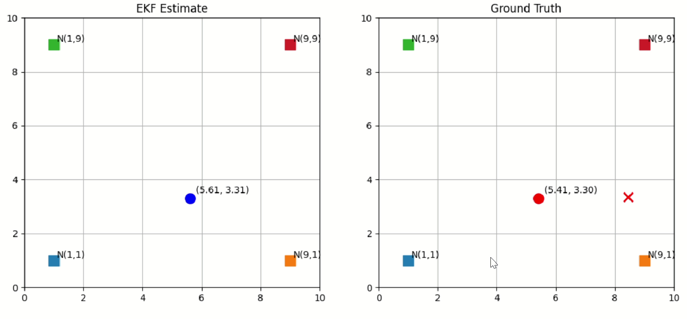
  </a>
  <br>
  <em>Click the image above to watch the EKF simulation (GitHub renders .mp4 files uploaded directly to a repo / release / issue).</em>
</p>

Simulation code: [`software/phase2_ekf_fusion/`](software/phase2_ekf_fusion)

### What's left

- [ ] Mount IMU on the physical robot and validate raw sensor output against the simulation's assumed noise model
- [ ] Replace simulated RSSI with live RSSI from the existing ESP32 mesh
- [ ] Tune `Q` and `R` covariance matrices against real hardware data
- [ ] Run side-by-side comparison: Phase 1 (RSSI-only) vs. Phase 2 (EKF-fused) on the same physical trajectory
- [ ] Quantify accuracy improvement (e.g. RMSE against a ground-truth track)

---

## Repository structure

```
ESP-Mesh-Nav/
├── README.md                          <- you are here
├── LICENSE
├── docs/
│   ├── report/
│   │   ├── EKF_derivation_indoor_navigation.docx
│   │   └── EKF_derivation_indoor_navigation.pdf
│   ├── media/
│   │   ├── system_architecture_diagram.png
│   │   ├── bot_hardware_photo.jpg
│   │   ├── fusion360_render.png
│   │   ├── ekf_simulation_demo.mp4
│   │   └── ekf_simulation_thumbnail.png
│   └── results/
│       ├── phase1_static/
│       │   ├── static_capture_01.png
│       │   ├── static_capture_02.png
│       │   └── static_capture_03.png
│       └── phase1_dynamic/
│           ├── motion_capture_01.png
│           ├── ...
│           └── motion_capture_08.png
├── hardware/
│   ├── fusion360/
│   │   └── chassis_design.f3d         <- (I will upload the design files in future)
│   └── images/
│       └── fusion360_render_full.png
├── firmware/                          <- (All the firmware will be uploaded here once project is completed)
│   ├── access_point_node/
│   │   └── access_point_node.ino
│   ├── robot_node/
│   │   └── robot_node.ino
│   └── master_node/
│       └── master_node.ino
└── software/
    ├── phase1_visualization/         <- (Will be uploaded here once project is completed)
    │   ├── trilateration_visualizer.py
    │   └── requirements.txt
    └── phase2_ekf_fusion/
        ├── ekf_simulation.py
        ├── requirements.txt
```

---

## Roadmap

- [x] Design and build robot chassis (Fusion 360 + acrylic + 3D-printed mounts)
- [x] Implement ESP32 access point / robot / master firmware over ESP-NOW
- [x] Implement RSSI-to-distance model and trilateration solver
- [x] Validate with static and dynamic preliminary tests
- [x] Derive full EKF model for IMU + RSSI fusion
- [x] Implement and validate EKF in simulation
- [ ] Integrate IMU on physical hardware
- [ ] Run EKF on live hardware data
- [ ] Quantitative accuracy comparison (Phase 1 vs Phase 2)
- [ ] (Stretch) Extend to 3+ room multi-AP coverage with handover
- [ ] Complete closed-loop EKF integration and conduct baseline accuracy evaluation (target: < 1.5 m 
mean error) on static grid.
- [ ] Implement adaptive noise covariance: dynamically adjust R based on instantaneous RSSI variance to 
handle environmental fluctuations.
- [ ] Extend to dynamic environments: introduce a moving person into the test space and quantify 
localization degradation, motivating the next research phase.
- [ ] Prepare conference paper draft: structure results around quantitative comparison of (1) RSSI-only, 
(2) IMU dead-reckoning, and (3) EKF-fused approaches. 
---

## Author

**[Muhammad Ibaad]** <br>
Undergraduate Research project — Indoor Localization & Navigation
<br>
*Feel free to reach out via GitHub issues or [ibaadsajidshaikh18@gmail.com] for questions about this project.*

---

## License

This project is released under the [MIT License](LICENSE) unless noted otherwise.
